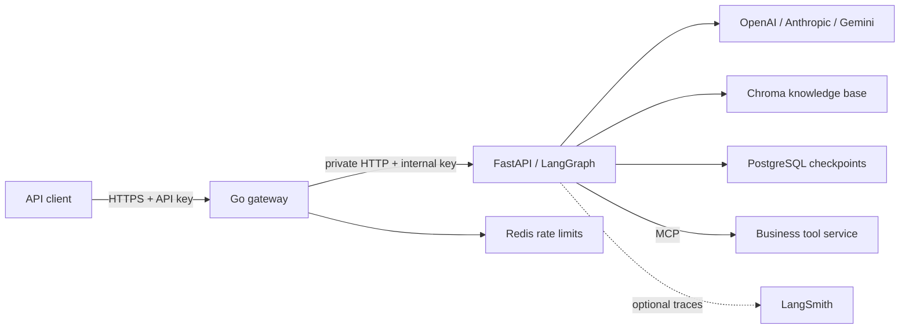
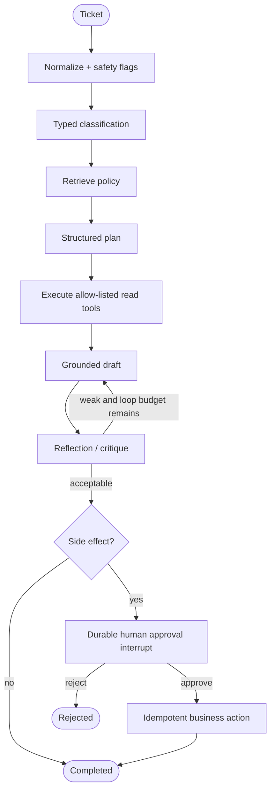

# Production Agentic AI Template

A production-oriented reference application for learning how an agent moves from a
notebook into a service. The business case is intentionally simple: receive a customer
support ticket, retrieve policy, inspect an order, draft and critique an answer, and
pause for human approval before issuing a refund.

The public API is Go. The agent runtime is Python with LangChain, LangGraph, LangSmith
hooks, FastAPI, PostgreSQL checkpoints, Chroma retrieval, Redis rate limiting, and an
MCP business-tool service. All external dependencies are behind small interfaces so
this repository can become the starting point for another domain.

## What this demonstrates

| Concept | Concrete implementation |
|---|---|
| Reasoning and routing | Typed classification followed by an explicit graph plan |
| Planning | A structured `Plan` chooses a read tool or proposed business action |
| Tool use | Allow-listed LangChain tools; order lookup is supplied over MCP |
| RAG / knowledge base | Markdown policies embedded into Chroma and cited in answers |
| Reflection | A typed critique can send a weak draft through one bounded revision loop |
| Human in the loop | LangGraph `interrupt()` pauses refunds, credits, and cancellation |
| Durable execution | PostgreSQL checkpointer persists every graph step and approval pause |
| Model portability | One adapter selects OpenAI, Anthropic, Google Gemini, or a test fake |
| Observability | Structured JSON logs plus opt-in LangSmith traces |
| Safeguards | Input limits, prompt-injection flags, delimited RAG context, tool allow-list |
| API hardening | Go edge API, body limits, timeouts, API key auth, request IDs, Redis limits |
| Correctness | Python unit/integration tests, Go handler tests, and container-level E2E |

The fake model and business actions are deterministic teaching adapters. They make the
entire workflow testable without API cost, but they must not be mistaken for production
AI or payment implementations.

## Architecture





## Repository map and key entry points

```text
services/
  gateway/                 Go public API, auth, validation, rate limiting
  agent/app/
    main.py                 FastAPI lifespan and dependency wiring
    graph/workflow.py       The full LangGraph workflow (start here)
    graph/state.py          Durable typed state passed between nodes
    core/models.py          Provider-neutral model adapter and typed outputs
    core/safety.py          Input and retrieved-context safety boundaries
    knowledge/repository.py Chroma and in-memory RAG implementations
    tools/registry.py       MCP loading, tool allow-list, idempotent actions
    api/routes.py           Internal run, approval, and knowledge endpoints
  mcp-tools/server.py       Standalone MCP business-tool example
data/knowledge/             Seed policy documents
tests/e2e/                  Public API lifecycle test
deploy/k8s/                 Portable production manifest
```

The best extension points are:

- `build_graph()` to add, remove, or reorder workflow capabilities.
- `SupportModel` to add a provider or local model without changing graph nodes.
- `KnowledgeRepository` to replace Chroma with pgvector or another store.
- `ToolRegistry` and the MCP server to connect real business systems.
- `require_approval_for` to change which actions require a reviewer.

Comments in those files call out the safety and durability rules that should survive
future customization.

## Quick start

Requirements: Docker with Compose. For local development without containers, install
Python 3.13, `uv`, and Go 1.26.

```bash
cp .env.example .env
# Put OPENAI_API_KEY in .env (never commit it).
docker compose up --build -d --wait
make seed
```

The public API is at `http://localhost:8080`; FastAPI documentation for the internal
service is at `http://localhost:8000/docs`. The default local public key is
`local-api-key`, while `.env.example` intentionally tells production users to replace it.

Create an ordinary read-only ticket:

```bash
curl -sS http://localhost:8080/v1/tickets \
  -H 'X-API-Key: local-api-key' \
  -H 'Content-Type: application/json' \
  -d '{
    "customer_id": "customer-42",
    "message": "Where is my order?",
    "order_id": "order-123"
  }'
```

That call blocks until the workflow finishes. To keep the client responsive, accept the
ticket immediately and follow the run over server-sent events instead:

```bash
TICKET=$(curl -sS http://localhost:8080/v1/tickets/async \
  -H 'X-API-Key: local-api-key' \
  -H 'Content-Type: application/json' \
  -d '{"customer_id":"customer-42","message":"Please refund order order-123","order_id":"order-123"}' \
  | jq -r .ticket_id)

curl -N http://localhost:8080/v1/tickets/$TICKET/stream -H 'X-API-Key: local-api-key'
```

The stream emits `running...` while nodes execute, `waiting for approval...` while the
graph is parked on an `interrupt()`, and finally a `result` event carrying the same JSON
the blocking endpoints return, then closes:

```text
event: status
data: running...

event: result
data: {"ticket_id":"...","status":"completed","answer":"Your order is in transit ..."}
```

A stream is capped by `STREAM_TIMEOUT_SECONDS` (300 by default); after that it sends a
`timeout` event and closes, and the client reconnects to the same ticket. Run state is
read from the durable checkpointer on every poll, so dropping a stream never affects the
run.

A refund request returns `waiting_approval` and a `pending_action`. Resume the same
durable graph thread with:

```bash
curl -sS http://localhost:8080/v1/tickets/TICKET_ID/decision \
  -H 'X-API-Key: local-api-key' \
  -H 'Content-Type: application/json' \
  -d '{"decision":"approve","reviewer":"manager-7","comment":"Policy verified"}'
```

Stop the stack with `make down`. Add `-v` to `docker compose down` only when you
intentionally want to delete local PostgreSQL, Chroma, and Redis data.

## Logging

```bash
docker compose logs -f gateway agent
```

```bash
docker compose logs -f agent
```

## API

| Method | Route | Purpose |
|---|---|---|
| `GET` | `/healthz` | Gateway health |
| `POST` | `/v1/tickets` | Start a durable support run and wait for it |
| `POST` | `/v1/tickets/async` | Accept a run and return `202` with a `ticket_id` |
| `GET` | `/v1/tickets/{ticket_id}` | Read current/completed run state |
| `GET` | `/v1/tickets/{ticket_id}/stream` | Follow a run over server-sent events |
| `POST` | `/v1/tickets/{ticket_id}/decision` | Approve or reject a pending action |
| `POST` | `/v1/knowledge` | Upsert knowledge documents |

All routes except health require `X-API-Key` or `Authorization: Bearer ...`. In a real
customer application, replace the shared key with JWT/OAuth validation at the gateway.
The internal Python endpoints additionally require a separate `X-Internal-API-Key` and
should never be internet-accessible.

## Model configuration

The default is OpenAI:

```dotenv
MODEL_PROVIDER=openai
MODEL_NAME=gpt-5-mini
OPENAI_API_KEY=...
```

Change only configuration to try another installed provider:

```dotenv
MODEL_PROVIDER=anthropic
MODEL_NAME=claude-sonnet-4-6
ANTHROPIC_API_KEY=...
```

or:

```dotenv
MODEL_PROVIDER=google
MODEL_NAME=gemini-3.1-pro-preview
GOOGLE_API_KEY=...
```

Model names evolve faster than application code, so verify availability in your account
before deployment. `MODEL_PROVIDER=fake` is reserved for tests and demos. Retrieval uses
OpenAI `text-embedding-3-small` independently of the chat provider; replace the small
embedding adapter in `repository.py` if you want fully provider-independent embeddings.

## LangSmith

LangChain/LangGraph automatically picks up the standard tracing environment variables:

```dotenv
LANGSMITH_TRACING=true
LANGSMITH_API_KEY=...
LANGSMITH_PROJECT=support-agent-template
```

Create separate projects for development, staging, and production. Before sending real
customer traffic, define a redaction/sampling policy and build a LangSmith dataset from
the deterministic test cases plus anonymized failures. Useful evaluation dimensions are
groundedness, citation correctness, correct tool selection, approval compliance, answer
quality, latency, and cost.

## Tests and quality checks

Install the locked toolchain and dependencies:

```bash
make install
```

Run fast checks:

```bash
make lint
make test-unit
```

Run the real public API against the container stack (fake model, real gateway,
PostgreSQL, Redis, MCP startup, and approval resume):

```bash
make test-e2e
```

Python tests cover graph routing, RAG boundaries, safeguards, internal authentication,
and pause/resume. Go tests cover edge authentication, JSON validation, and proxying.
CI repeats these checks, runs Go's race detector, and builds all application images.

## Production deployment

Use managed PostgreSQL and Redis; use Chroma Cloud or a persistent Chroma deployment.
Run the gateway publicly and keep the agent and MCP tool service on private networking.
The portable Kubernetes example and cloud-service mapping are in
[`docs/deployment.md`](docs/deployment.md).

Production work that is intentionally left domain-specific:

- Replace the deterministic order and refund implementations with authenticated APIs.
- Store refund idempotency in the destination business system, not process memory.
- Add tenant-aware JWT authorization and tenant-scoped knowledge filtering.
- Add provider moderation and organization policy checks for your risk profile.
- Add migrations/retention policy for application data beyond LangGraph checkpoints.
- Make async runs multi-replica safe. `BackgroundRuns` (`core/runs.py`) tracks liveness and
  failure in process memory, so `POST /v1/tickets/async` and its stream must reach the same
  agent replica; move that bookkeeping to Redis or a runs table, and resume orphaned
  checkpoints on boot, before scaling the agent out.
- Add token-level streaming (`graph.astream`) if clients need partial drafts; the current
  stream reports step-level status only.

## Why the services are split

Go owns the stable, high-concurrency public contract and cross-cutting edge controls.
Python owns the fast-moving model ecosystem and LangGraph. MCP keeps business tools
independent of the agent process. PostgreSQL makes long-running approval workflows
durable across deploys; Redis handles only disposable edge counters; Chroma is hidden
behind a repository interface. This separation gives future projects clear seams without
turning a small teaching example into a large microservice estate.

